# Лабораторная работа №2 Облачные вычислительные сервисы. Amazon EC2
## Cloud Computing

Kirov Kiril `IA-2404` Informatica Aplicata

# Теоретическая часть

## Цель работы
Научиться запускать и настраивать виртуальные машины **Amazon EC2**, подключаться к ним по SSH, диагностировать их состояние и разворачивать на них веб-приложение: от статической страницы до настоящего приложения с базой данных, которое сервер сам забирает из репозитория **GitHub**.

### Пользователь IAM (IAM user) 
 учётная запись внутри аккаунта AWS, у которой есть собственный логин и собственный набор прав. Это основной способ предоставления доступа отдельным людям к ресурсам AWS без использования root-пользователя.

# Практическая часть 

Для начала я создал и вошел как `IAM user` без прав доступа: 

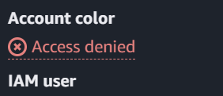

## Часть 1. Базовый уровень

### Задание 1. Подготовка аккаунта

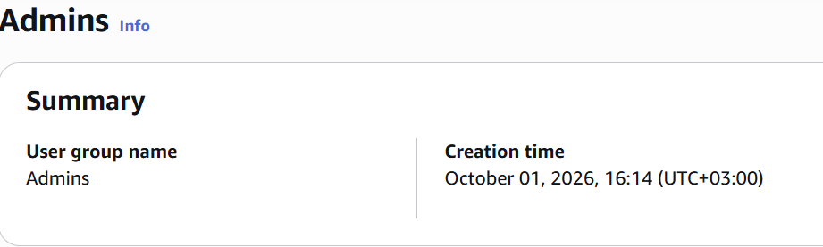

Политика AdministratorAccess предоставляет пользователю практически полный доступ ко всем ресурсам AWS.

То есть пользователь может создавать, изменять и удалять практически любые AWS-ресурсы: EC2, S3, RDS, IAM, VPC и т. д.

    Почему нельзя использовать Root для повседневной работы?

Root User имеет максимальные права в AWS, и его использование для обычных задач опасно:

ошибка может привести к удалению или изменению важных ресурсов;
если credentials Root будут украдены, злоумышленник получит полный контроль над аккаунтом;
Root нельзя ограничить обычными IAM policies;
рекомендуется использовать Root только для задач, которые требуют именно Root-доступа.


Настроил бюджет с нулевым порогом, чтобы получить письмо, как только аккаунт начнёт тратить деньги

## Задание 2. Запуск экземпляра EC2

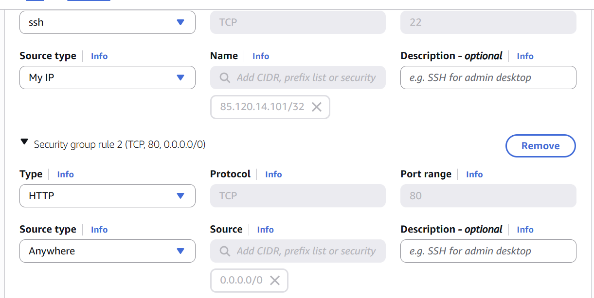

Скрипт для RHEL-подобных систем (Fedora, CentOS, Rocky, Alma):

`#!/bin/bash` — выполнять скрипт в bash.
`dnf -y update` — обновить все пакеты (-y — без запроса подтверждения).
`dnf -y install htop nginx` — установить монитор процессов htop и веб-сервер nginx.
`systemctl enable --now nginx` — включить автозапуск nginx при загрузке и сразу запустить его.

`htop` — интерактивный монитор процессов в терминале. Показывает загрузку CPU по ядрам, использование памяти и swap, список процессов с PID, пользователем и потреблением ресурсов. Позволяет сортировать процессы и завершать их (kill) прямо из интерфейса. Удобнее и нагляднее стандартного top.

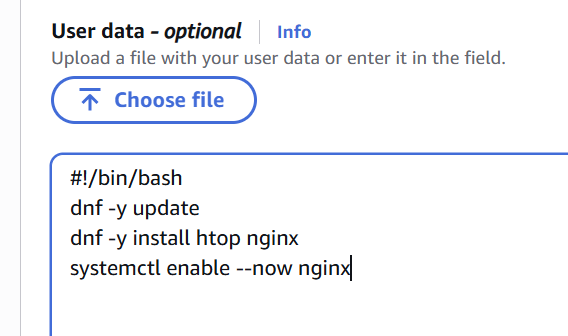

    Что такое User data и когда выполняется этот скрипт? Выполнится ли он повторно после перезагрузки экземпляра?   

**User data** — это скрипт или данные, которые передаются облачному экземпляру при создании. Служба cloud-init внутри ОС читает их и выполняет автоматически, без ручного входа на сервер. Используется для начальной настройки: установка пакетов, запуск сервисов и т.д.

**После перезагрузки:** нет, повторно не выполнится. По умолчанию **user data** запускается только при первом старте. Чтобы он выполнялся при каждом запуске, нужно специально настроить cloud-init 

При этом nginx после перезагрузки всё равно запустится, потому что `systemctl enable` включил его автозапуск. То есть результат скрипта сохраняется, а сам скрипт заново не запускается.


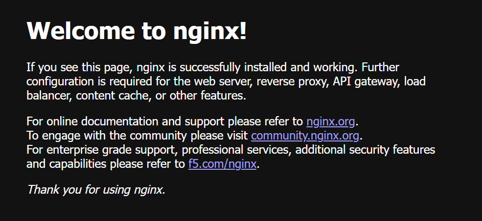

## Задание 3. Мониторинг и диагностика

    Какая из проверок укажет на проблему, которую можете исправить вы, а какая на проблему на стороне AWS?

 ### 1. Status checks

На проблему которую могу исправить я, укажет `Instance Status Check` в основном изза неправильной конфигурации системы, ядро, сеть, файловая система и тд

А на проблему на стороне AWS указывает S`ystem status check`

### 2. Monitoring

    В каких случаях стоит включать детальный мониторинг? отвкеть одним предложением

Детальный мониторинг (метрики каждую минуту вместо 5 минут) стоит включать, когда нужно быстро замечать скачки нагрузки и оперативно реагировать: для production-систем, настройки автомасштабирования (Auto Scaling) и аварийных оповещений CloudWatch.

`Actions` → `Monitor and troubleshoot` → `Get system log`

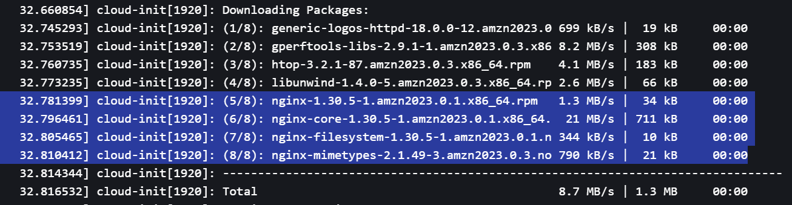

`Actions` → `Monitor and troubleshoot` → `Get instance screenshot`

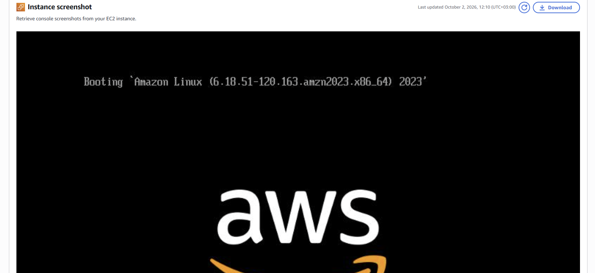

## Задание 4 Подключение по SSH

меняем права для приватного ключа и подключаемся успешно по ssh:

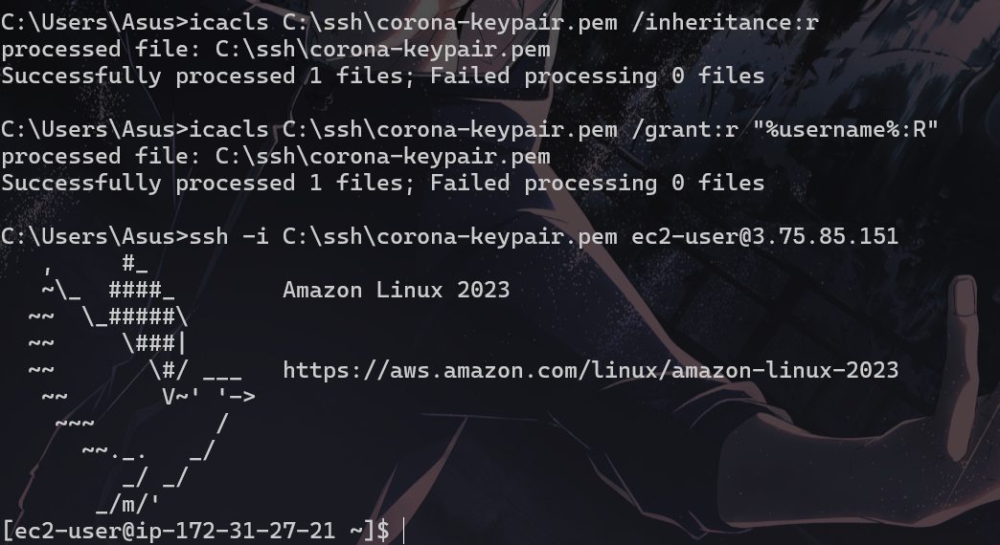

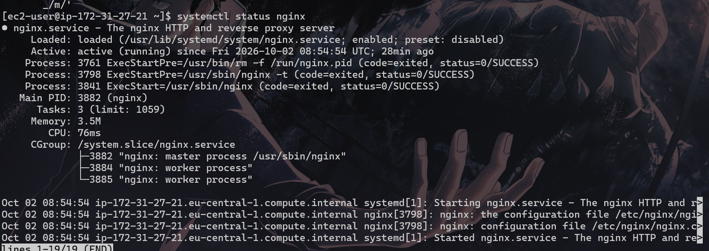

    Почему для входа на экземпляр EC2 используется ключ, а не пароль?

Потому что ключи безопаснее паролей:

- Нельзя подобрать перебором. Пароль можно угадать или взломать брутфорсом, а приватный ключ (2048+ бит) практически невозможно. Экземпляр с публичным IP постоянно сканируют боты, и пароли быстро подбирались бы.
- Секрет не передаётся по сети. При входе приватный ключ остаётся у вас: вы лишь доказываете, что владеете им (подпись), а на сервере хранится только публичный ключ.
- Нет слабых паролей. Ключ генерируется автоматически, его нельзя сделать «123456» или использовать повторно на других сервисах.
- Автоматизация. Ключи удобны для скриптов и инструментов (Ansible, CI/CD): не нужно хранить и вводить пароль.

## Задание 5. Статический сайт

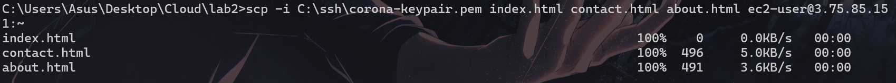

scp (secure copy) копирует файлы между вашим компьютером и удалённым сервером по защищённому каналу. Синтаксис: scp [откуда] [куда], где удалённый путь записывается как user@host:путь.

**Чем похожа на ssh:**

- работает поверх протокола SSH (тот же порт 22, то же шифрование);
использует ту же аутентификацию: ключ через -i, тот же user@host;
использует тот же файл known_hosts для проверки сервера.

- **Отличие**: ssh открывает удалённую консоль для выполнения команд, а scp только передаёт файлы и завершается.

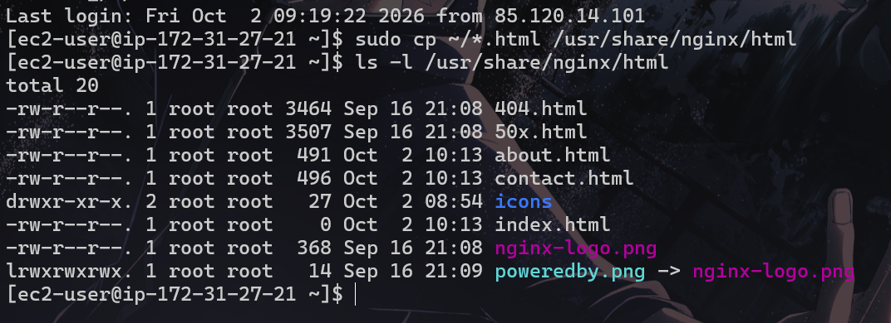

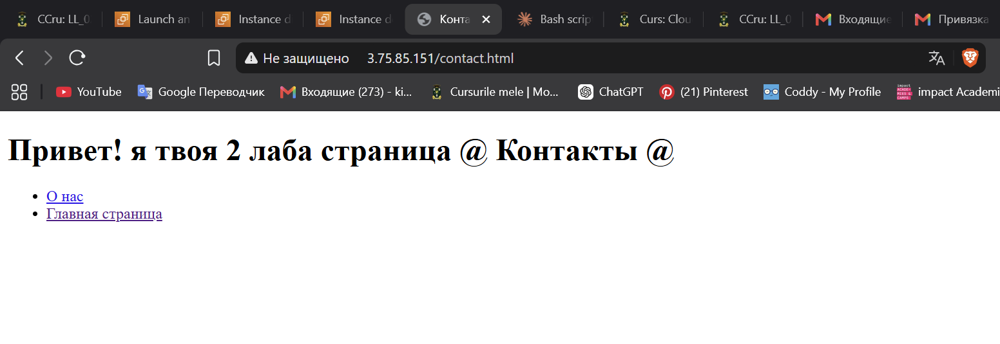

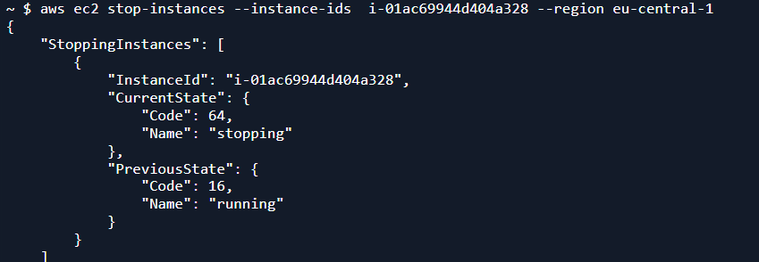

Stop останавливает экземпляр, но не удаляет его: его можно запустить снова (Start), при этом данные на EBS-томах сохраняются. Terminate удаляет экземпляр навсегда: восстановить его нельзя, а корневой том EBS по умолчанию тоже удаляется (если не отключён флаг Delete on termination).

За что плачу, пока экземпляр остановлен:

    EBS-тома (хранение гигабайт, пока тома существуют);
    Elastic IP, если он выделен, но не привязан к работающему экземпляру;
    снапшоты и AMI, если они созданы.

За что не плачу: за вычислительное время экземпляра (инстанс-часы). Также при остановке теряется обычный публичный IP (при следующем запуске будет новый), а данные на instance store исчезают.

## Задание 6

Ввел в терминал в AWS CloudShell

```
aws ec2 stop-instances --instance-ids <i-01ac69944d404a328> --region eu-central-1
```

## Задание 7 `crownhahaha-cloud  `

Создал аккаунт организации `crownhahaha-cloud`

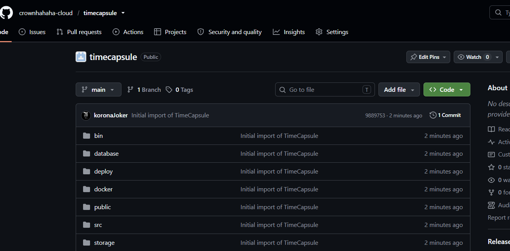


Папка vendor хранит тысячи файлов которые можно восстановить легко командой `composer install`, все данные, версии и названия библиотек уже хранятся в ``composer.json`

ДотЕнв файл хранит переменные окружения, которые безопасно хранят пароли токены, имена, вобщем все уязвимые данные, доступ к которым должен быть только у меня.
`

## Задание 8. Подготовка сервера

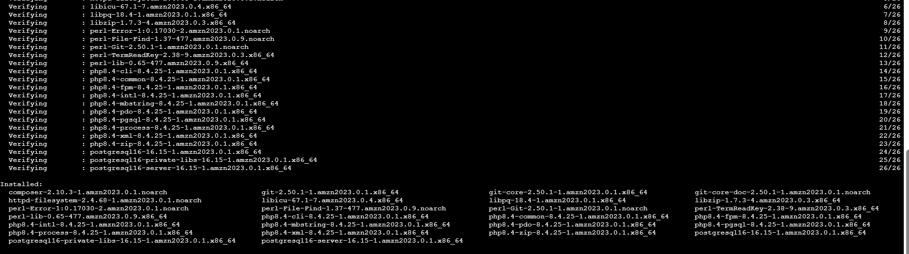

| Пакет                     | Зачем нужен                                                                            |
| ------------------------- | -------------------------------------------------------------------------------------- |
| **`git`**                 | Скачивание и обновление кода приложения из Git-репозитория                             |
| **`composer`**            | Менеджер зависимостей PHP; устанавливает библиотеки, указанные в `composer.json`       |
| **`postgresql16-server`** | Сервер базы данных PostgreSQL 16, в котором будут храниться данные приложения          |
| **`php8.4-fpm`**          | PHP-FPM выполняет PHP-код приложения и передаёт результаты веб-серверу Nginx           |
| **`php8.4-cli`**          | Позволяет запускать PHP из командной строки; нужен для Composer и команд `php artisan` |
| **`php8.4-pgsql`**        | Расширение PHP для подключения и работы с PostgreSQL                                   |
| **`php8.4-mbstring`**     | Поддержка многобайтовых строк; используется некоторыми PHP-библиотеками и Laravel      |
| **`php8.4-xml`**          | Работа с XML; требуется некоторыми PHP-библиотеками и Composer-зависимостями           |

    Почему мы устанавливаем эти пакеты вручную, а не добавляем их в User data?

Это удобно для учебной работы и отладки: ты видишь каждую команду и сразу можешь проверить результат.

Например:

```
php -v
git --version
psql --version
```

Если что-то не работает — понятно, на каком шаге возникла проблема.  
Если всё положить в User Data, часть этих действий станет автоматической, и ты меньше увидишь, как именно сервер настраивается.

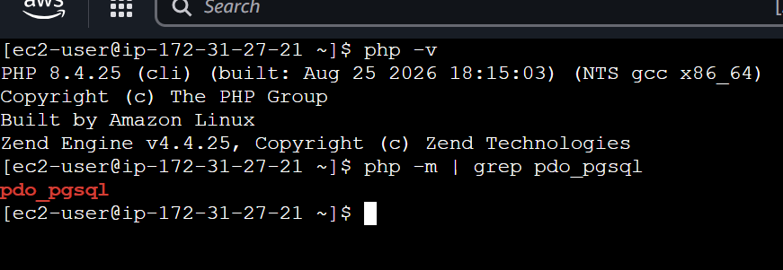

## Задание 9. База данных PostgreSQL


```bash
# Команда

[ec2-user@ip-172-31-27-21 ~]$ sudo postgresql-setup --initdb
sudo grep -v '^#' /var/lib/pgsql/data/pg_hba.conf | grep -v '^$'
```

```bash
#Результат

[ec2-user@ip-172-31-27-21 ~]$ sudo postgresql-setup --initdb

 * Initializing database in '/var/lib/pgsql/data'
 * Initialized, logs are in /var/lib/pgsql/initdb_postgresql.log
```

файл `pg_hba.conf` — он определяет, кто и откуда может подключаться к PostgreSQL.

сейчас `PostgreSQL` разрешает локальные подключения, но не подключения к БД извне сервера.

Метод ident означает:

 *"пускать, только если имя пользователя в Linux совпадает с именем пользователя в базе"*

Заменим ident на scram-sha-256, то есть проверку по паролю:

```bash
sudo sed -i 's/ident$/scram-sha-256/' /var/lib/pgsql/data/pg_hba.conf
```

Запуск **PostgreSQL** и включение его автозапуск:

```bash
sudo systemctl enable --now postgresql

Created symlink /etc/systemd/system/multi-user.target.wants/postgresql.service → /usr/lib/systemd/system/postgresql.service.

```

```bash
[ec2-user@ip-172-31-27-21 ~]$ sudo -u postrgres psql -c "CREATE USER timecapsule WITH PASSWORD 'пароль-не-скажу'"
CREATE ROLE

[ec2-user@ip-172-31-27-21 ~]$ sudo -u postgres psql -c "CREATE DATABASE timecapsule OWNER timecapsule;
> "

CREATE DATABASE
```
```bash
[ec2-user@ip-172-31-27-21 ~]$ psql -h localhost -U timecapsule -d timecapsule -c "SELECT 1;"
Password for user timecapsule: 
 ?column? 
----------
        1
(1 row)
```

## Задание 10. Развёртывание кода приложения на сервере
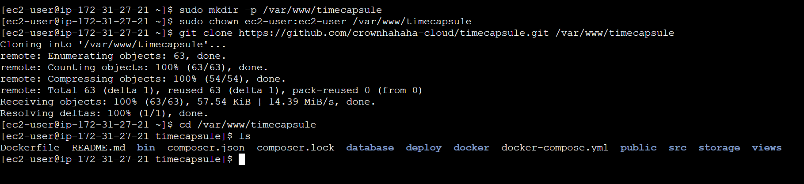

Вставьте в него содержимое, подставив свой IP-адрес и пароль к базе из задания 9:

```js
APP_URL=http://<Public-IP>
APP_DEBUG=false

DB_HOST=localhost
DB_PORT=5432
DB_NAME=timecapsule
DB_USER=timecapsule
DB_PASSWORD=ваш-пароль

UPLOAD_DIR=storage/uploads
MAX_UPLOAD_MB=5
MAIL_DELAY_SECONDS=3
AUTH_ENABLED=true
```

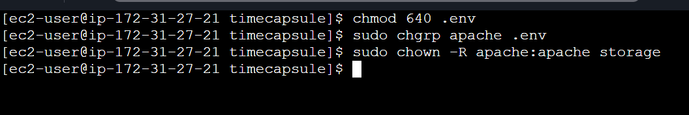

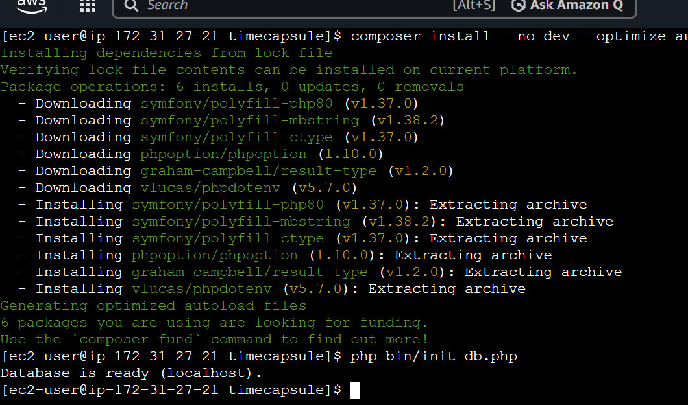

    Почему публичный репозиторий безопасен

Публичным является код приложения, но не секреты:

    GitHub
    ├── исходный код ✅ публичный
    ├── composer.json ✅ публичный
    ├── .env.example ✅ публичный
    └── .env ❌ не публикуется

На сервере находится настоящий .env:

    EC2
    └── /var/www/timecapsule/.env
        ├── DB_USERNAME
        └── DB_PASSWORD

Таким образом, даже если кто-то увидит весь код на GitHub, он не получит пароль от базы данных.

публичный репозиторий безопасен только при условии, что секреты нигде не закоммичены — ни в .env, ни в исходном коде, ни в истории Git.

## Задание 11. Настройка PHP-FPM и nginx
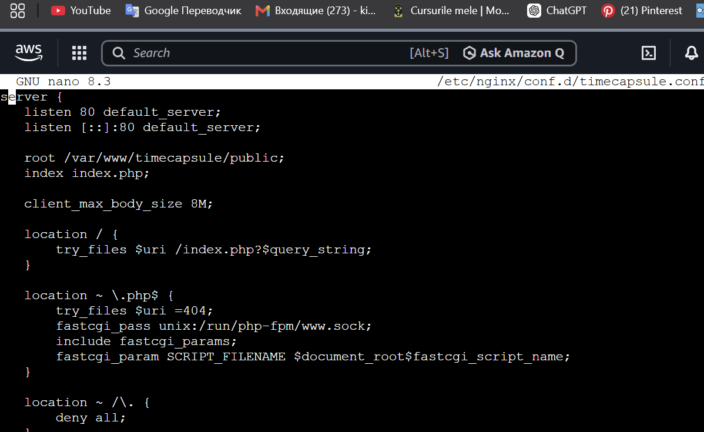

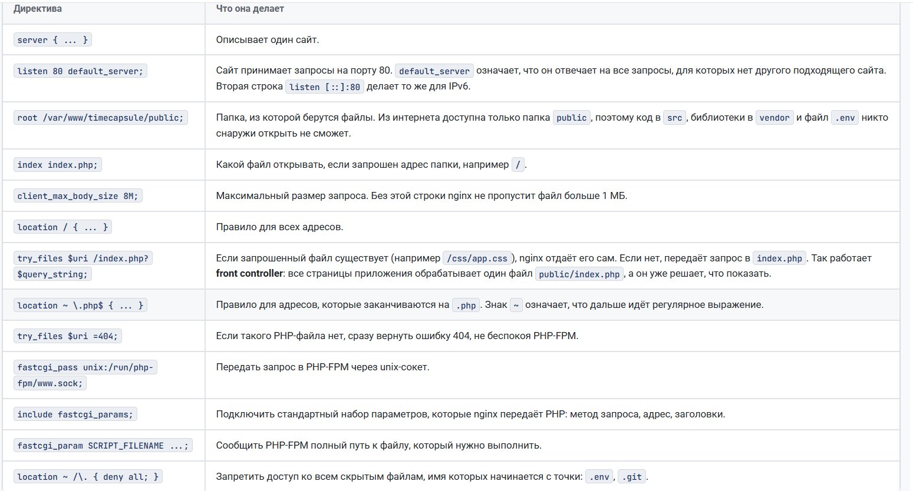

```bash
sudo nginx -t # Проверка конфигурации на ошибки
sudo systemctl enable --now php-fpm # Включение и запуск PHP-FPM
sudo systemctl restart nginx # Перезапуск nginx с новой конфигурацией
```

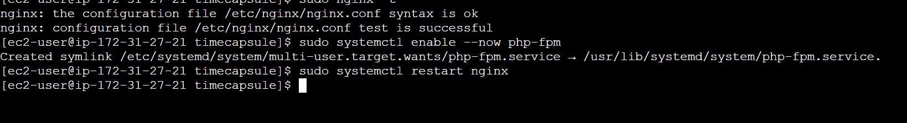

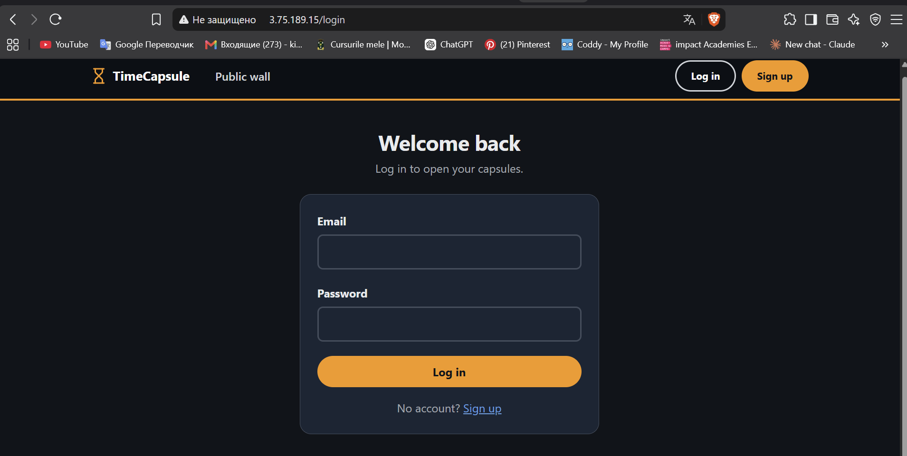

## Задание 12. Обновление приложения

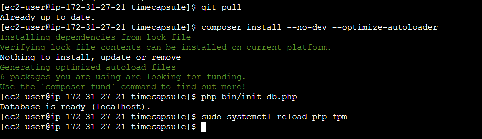

1. Что может увидеть посетитель во время git pull?
В зависимости от того, какие именно файлы обновляются в данный момент, пользователь может столкнуться со следующими неприятными эффектами:

Ошибка 500 (Internal Server Error): Это самый частый сценарий. Например, Git обновил контроллер, который вызывает новый метод, но файл с представлением (view) или новая миграция еще не обновились. Либо PHP начал компилировать файлы в момент, когда они еще не до конца записались на диск.

Ошибки синтаксиса или «белый экран смерти»: Если PHP-скрипт прочитан веб-сервером ровно в тот момент, когда Git перезаписывает его (файл на доли секунды оказывается обрезаным или пустым).

Сломанный интерфейс (CSS/JS): Если обновился HTML-код (шаблон), а новые файлы стилей или скриптов еще не подтянулись, или наоборот. Браузер попытается загрузить несуществующие ассеты.

2. Что случится с сайтом, если не выполнить composer install?
Если в вашем коммите изменились зависимости (файлы composer.json или composer.lock), а вы забыли запустить composer install, сайт практически гарантированно упадет:

Ошибка Class ... not found: Новый код проекта может требовать сторонние библиотеки или новые классы, которые прописаны в автозагрузщике (autoload), но физически папки vendor/ для них еще нет или она старая.

Мгновенный сбой при первом же запросе, использующем новый функционал, со стандартной страницей ошибки 500.

Если же в коммите менялся только ваш собственный код (без изменения зависимостей в composer.json), то сайт может продолжить работать, но пренебрегать проверкой зависимостей все равно опасно.

### Как делать правильно и избежать проблем?

**1. Режим обслуживания (Maintenance Mode):**
Перед началом обновления сайт переводят в режим заглушки, выполняют все команды, а затем возвращают обратно.

**2. Атомарный деплой (Zero-Downtime Deployment):**
Профессиональные инструменты деплоя (например, Deployer, Envoyer или GitHub Actions) загружают и готовят новую версию кода в абсолютно чистой папке рядом, полностью выполняют composer install, сборку фронтенда и миграции, а в самый последний момент одной ссылкой (symlink) переключают веб-сервер на новый код. Для посетителей переход происходит мгновенно и незаметно.

## Задание 13. Новая версия, поломка и откат

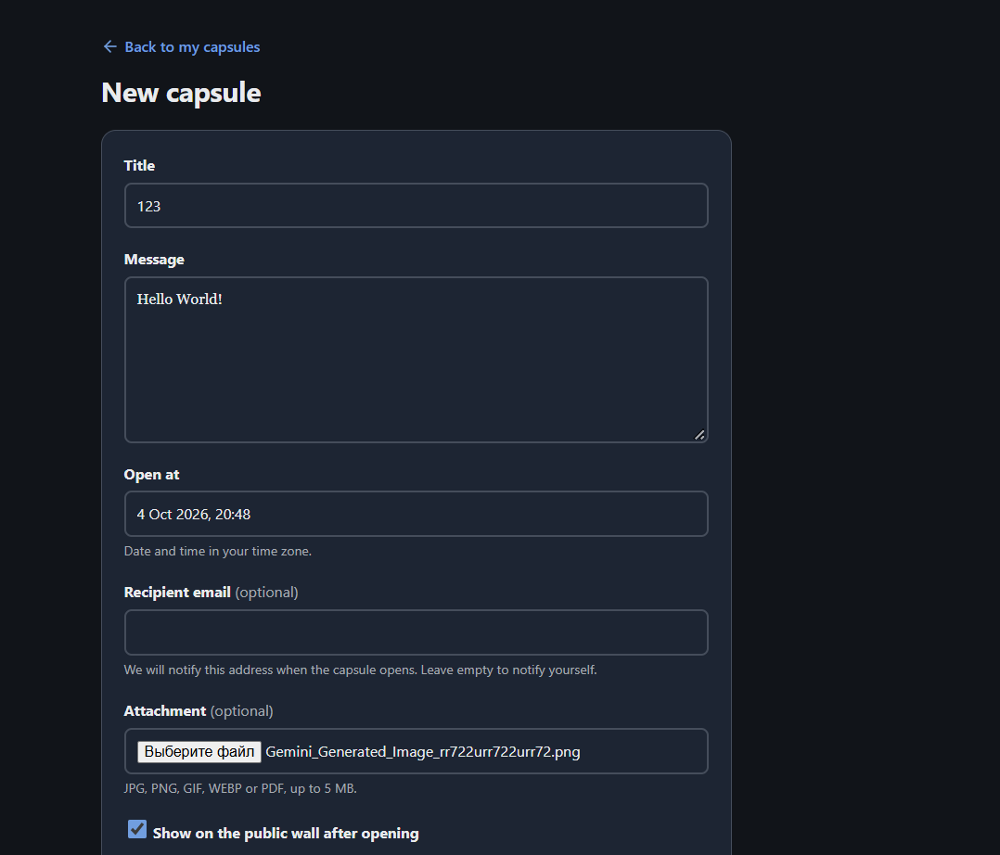

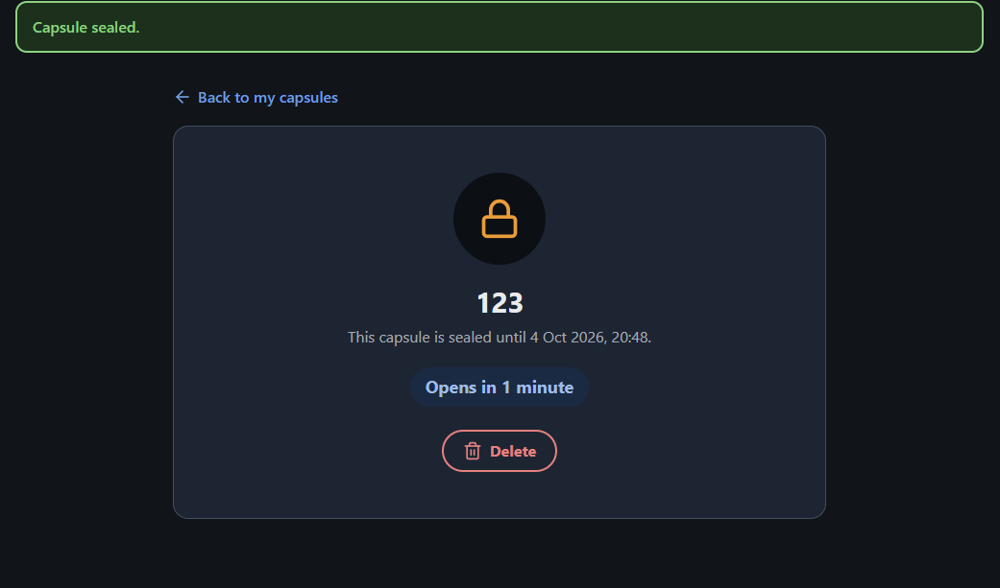

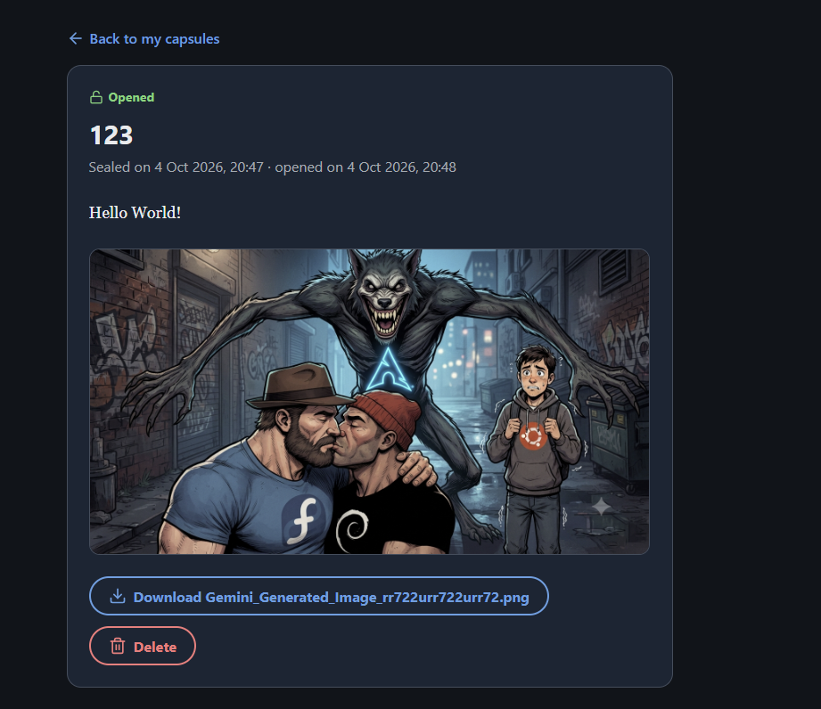

Обновил сайт на гите 

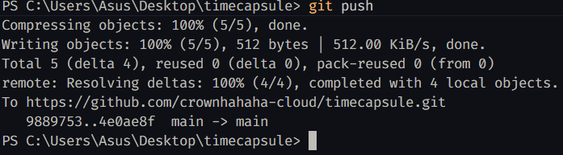

Опять вводим врунчую команды 

```bash
cd /var/www/timecapsule
git pull
composer install --no-dev --optimize-autoloader
php bin/init-db.php
sudo systemctl reload php-fpm
```

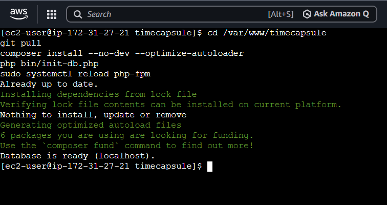

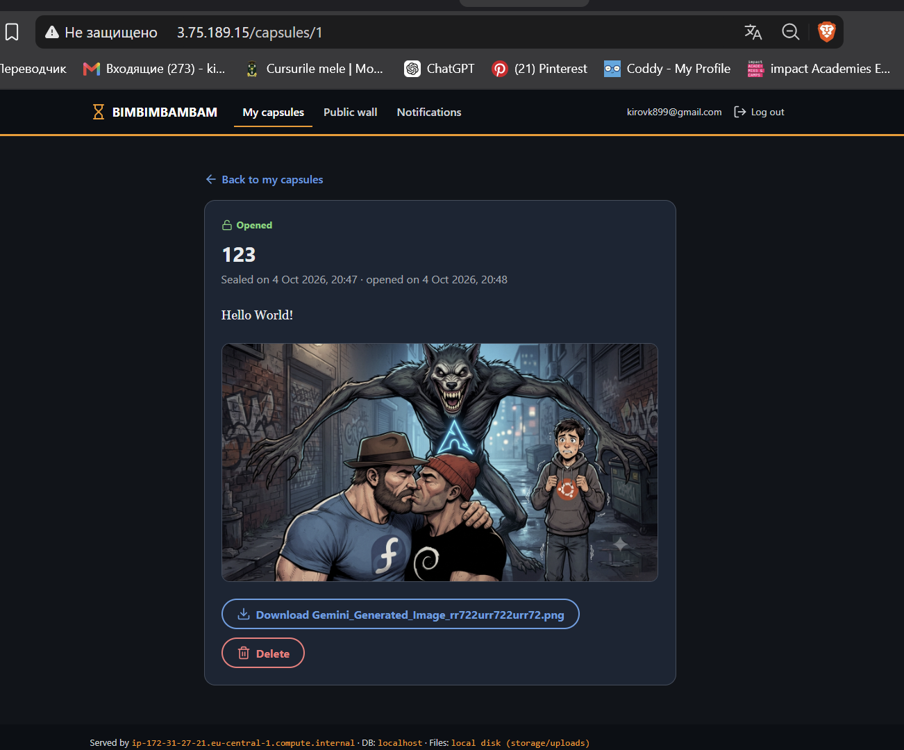


ЛОМАЕМ САЙТ И ПУШИМ

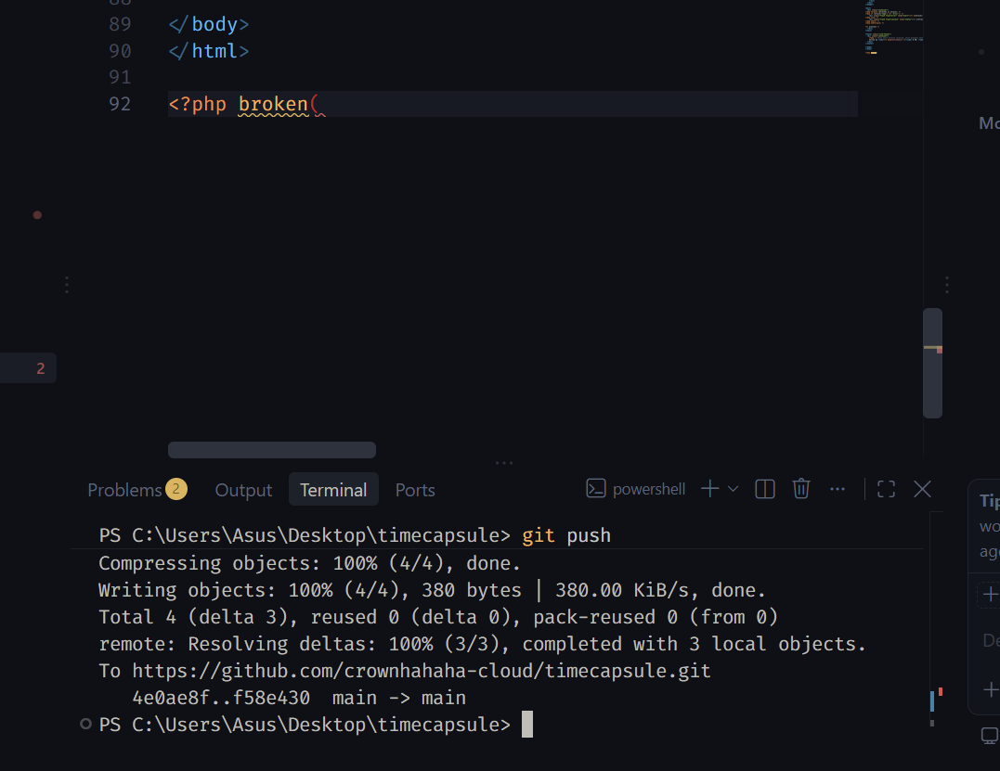

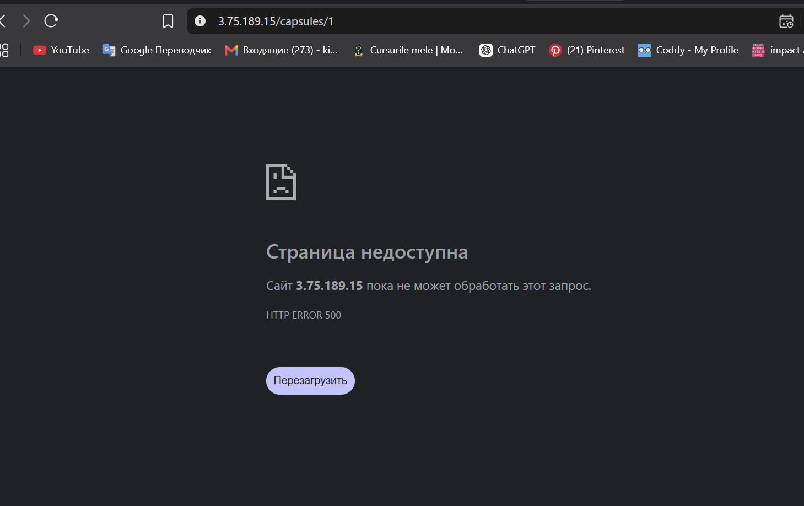

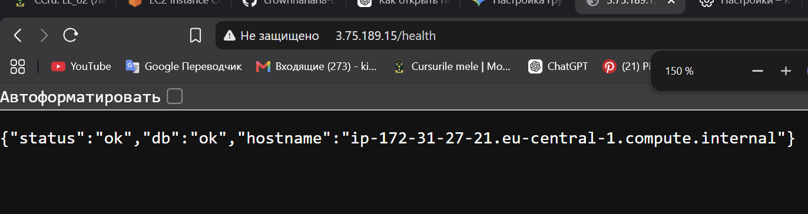

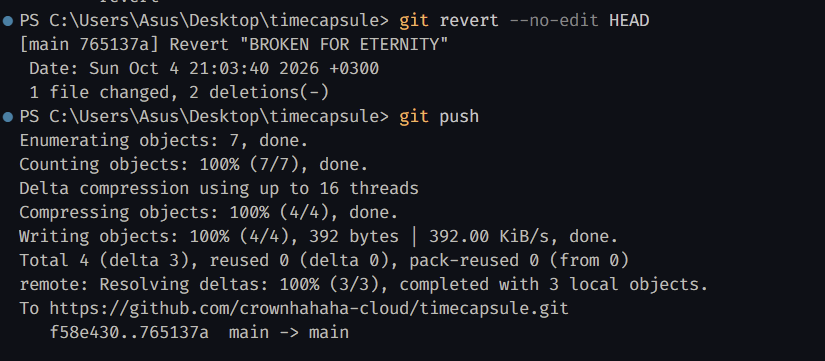

```js
git revert --no-edit HEAD
```

создаёт новый коммит, который отменяет изменения последнего коммита.

`git revert` — отменить изменения коммита, не удаляя его из истории.
`HEAD` — текущий последний коммит.
`--no-edit` — не открывать редактор для изменения сообщения нового коммита.

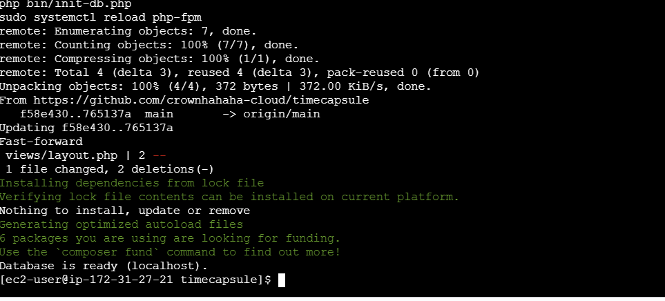

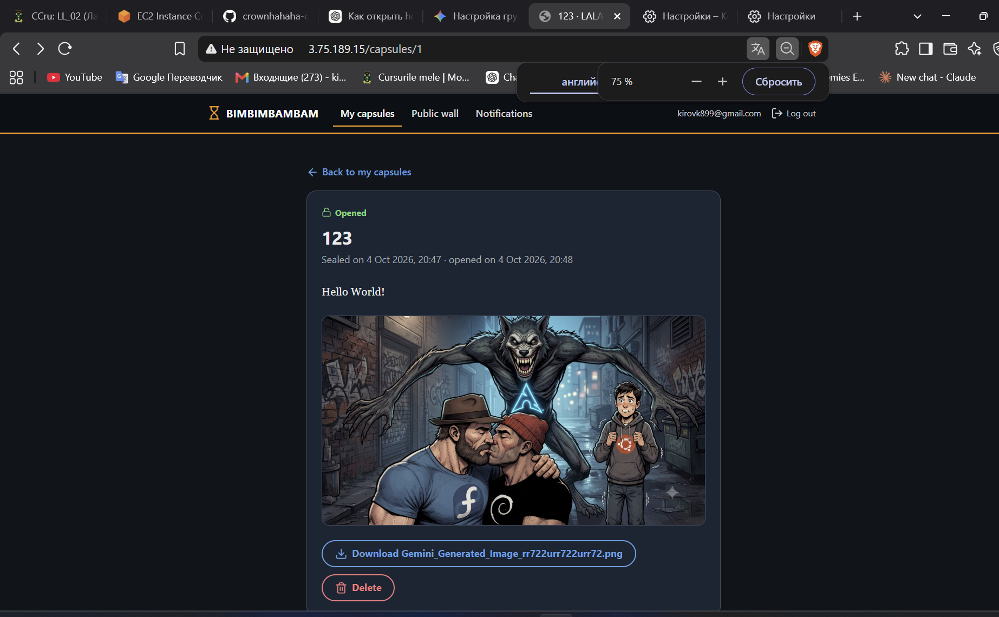

## Задание 14. Архитектура и решение


# Контрольные вопросы

1. **Запрос от браузера до БД:**
   Браузер → **Nginx** → приложение на сервере → **PHP** → **PostgreSQL**.
   **Пример:** пользователь открывает `/users` → PHP получает данные из PostgreSQL → возвращает страницу.

2. **Почему сервер только скачивает код:**
   Сервер имеет доступ **только на чтение** к репозиторию. Это безопаснее, потому что сервер не может случайно изменить или удалить исходный код.
   **Пример:** `git pull` работает, а `git push` — нет.

3. **Что будет с файлами при удалении EC2:**
   Если файлы хранятся на **EBS**, они обычно сохраняются при удалении EC2, если том не удаляется вместе с экземпляром. Если файлы были только на локальном временном хранилище — они пропадут.
   **Пример:** EBS можно подключить к новому EC2 и получить файлы обратно.

4. **Связь с CI/CD:**
   `deploy.sh` выполняет те же основные действия: **получить код → установить зависимости → собрать/запустить приложение → проверить результат**.
   Не хватает автоматического запуска по `git push`, тестов, логирования и автоматического отката при ошибке.
   **Пример:** GitHub Actions может сам запустить `deploy.sh` после `git push`.
